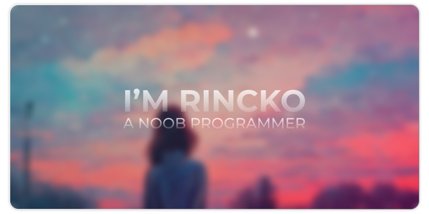
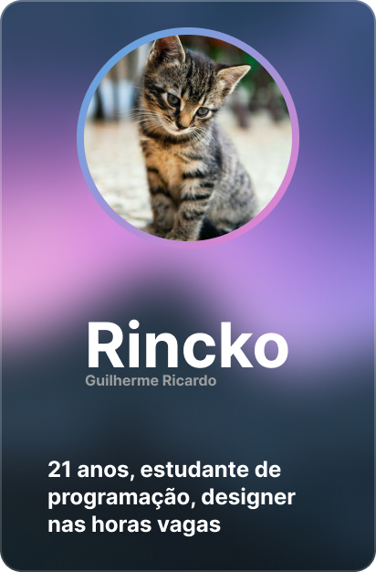

<!--  -->

  
  &#8287;&#8287;&#8287;&#8287;&#8287;
  
  &#8287;&#8287;&#8287;&#8287;&#8287;
  
   
  My name is Guilherme but you can call me Rincko, I'm 21 years old, a programming student, and I live in Brazil.

### 💻 Currently working on [Zunder System](https://github.com/rinckonobre/ZunderSystem)

  

    <h2>Interests</h2>
    <ul>
      <li>🎮 Online games</li>
      <li>🎥 Marvel movies</li>
      <li>🐱 Cute cats</li>
    </ul>
  

  

    <h2>Ambitions</h2>
    <ul>
      <li>⭐ Be the best at what I do</li>
      <li>🔭 Learn every programming language I can</li>
      <li>🔎 Always ready to help anyone</li>
    </ul>
  

  
## 🔨 Language and Tools

  

    <h2>Medium level</h2>
    

  

  

    <h2>Learning</h2>
    

  

