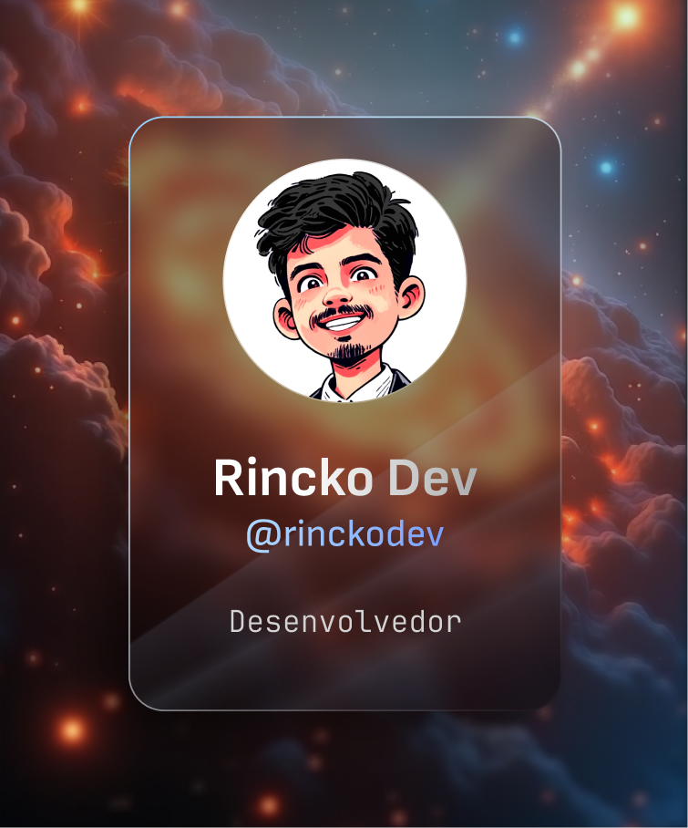

- [Youtube](https://youtube.com/@rinckodev)
- [Linkedin](https://www.linkedin.com/in/guilherme-ricardo-414342176/)
- [Instagram](https://www.instagram.com/rincko_)
- [Npm](https://www.npmjs.com/~rinckodev)
- [Discord](http://discord.gg/tTu8dGN)

My name's Guilherme but you can call me "Rincko", I'm 22 years old, a NodeJs Typescript developer, and I live in Brazil.

### 💻 Currently working on
- [Constatic CLI](https://github.com/rinckodev/constatic)
- [Magicyan](https://github.com/rinckodev/magicyan)

### My projects

📚 [Learn NodeJs Javascript development (for free on my youtube)](https://www.youtube.com/watch?v=lQAJ-T1QTYc&list=PL9tY_tDo_Q0C0hs1aGgtJbEH1EBlyzZdG)

📚 [Learn NodeJs Typescript development (for free on my youtube)](https://www.youtube.com/watch?v=4pIo-p6pX34&list=PL9tY_tDo_Q0DOAzTaPnWYsryfNLsz1K6U&pp=iAQB)

# Ambitions

- ⭐ Be the best at what I do
- 🔭 Learn more every day
- 🔎 Always ready to help anyone
  
## 🔨 Language and Tools

